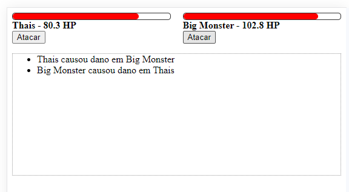

<h1 align="center"> Projeto de Luta </h1>

  <a href="#-tecnologias">Tecnologias</a>&nbsp;&nbsp;&nbsp;&nbsp;&nbsp;&nbsp;

 

  

## 🚀 Tecnologias

Esse projeto foi desenvolvido com as seguintes tecnologias:

- HTML e CSS
- JavaScript
- Git e Github

## 💻 Projeto

Projeto de Luta, que consiste em interações, utilizando conhecimentos de orientação a objetos.

## :memo: Licença

Esse projeto está sob a licença MIT.

---
  Projeto fornecido pelo curso da B7Web